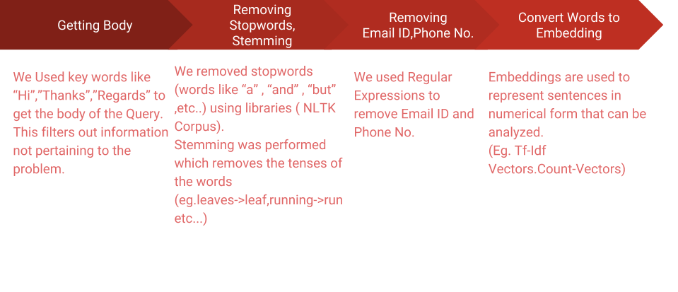
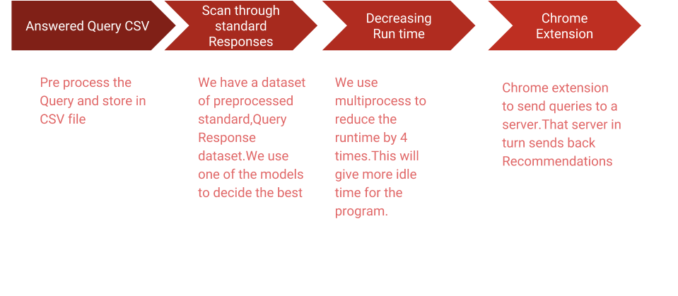

# QueryAnswerRecommend
Summer Intership 2018 Project at Perfios software solution Pvt Ltd

Model for recommending answers to customer support queries was built using tensorflow and trained on previous query responses.

## Datapreparation

## How the program runs?

## Different Approaches Used

* Cosine Similarity With Tf-idf Vectors
* K-means clustering with doc2vec vectors
* Two LSTM with Tf-idf 

### Cosine Similarity with Tf-idf Vectors
 1. Create a big coprpus using the data.
 2. Train the count vectoriser and tfidf model.
 3. Get most similar by comparing the vector for each query from training data and find its consine similarity with the test       query vector.

### K-means clustering with doc2vec vectors

1. Create a Doc2Vec and model and train it.
2. Calculate sentence vectors of Queries from trained model
3. Perform K-Means Clustering on trained data.
4. Give corresponding response of the queries in which test query belongs to.

### 2-LSTM aprroach
[Link to paper on the two LSTM approach](https://arxiv.org/pdf/1707.01378.pdf)

### Chrome  Extension 
The purpose of the extension is so that it sends a POST request of a highlited text(in our case the query for which response is requires) to our server
which inturn gives back the suggested response.
